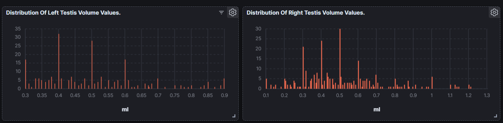
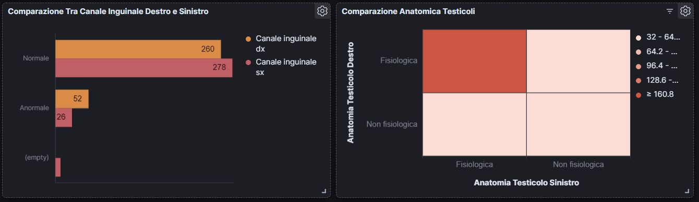
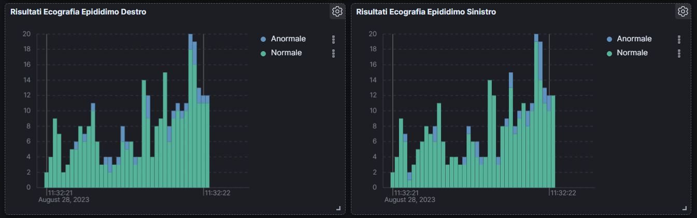

<h1 align="center">MedScan (Medical Scanner)</h1>
<p align="center">Medical feature extractor. 
</p><br>

<p align="center"> 
</p><br>

## :memo: Requirements
 - Docker & Docker Compose
 - In order to to use ChatGPT-4 API, one possible solution is to create an Azure account and enable OpenAI services.<br>
 If you are a student, follow my [guide](https://github.com/WoWS17/Azure-For-Students-Guide) to get an Azure account with $100 credit and no credit card required!
 


## ⚡ Quickstart
```shell
$ git clone https://github.com/WoWS17/MedScan.git

$ cd ./kafka/setup

$ wget https://dlcdn.apache.org/kafka/3.4.0/kafka_2.13-3.4.0.tgz

$ cd ../../

$ echo 'export AZURE_OPENAI_ENDPOINT=<Your OpenAI Endpoint>' >> ~/.bashrc

$ echo 'export AZURE_OPENAI_KEY=<Your OpenAI Secret Key>' >> ~/.bashrc

$ source ~/.bashrc

$ docker compose up
```


## 📊 Data flow 
<p align="center">
  
</p>


## Data Source
The data analysed were provided by a doctor.
They are diagnoses made following ultrasound examinations of the male inguinal-scrotal regions.

<center></center>

##  LogStash
### What is it?
Logstash is a free and open server-side data processing pipeline that  ingests data from a multitude of sources, transforms it, and then sends it to your favorite "stash."


##  Kafka
### What is it?
Apache Kafka is an open-source event streaming platform that enables the management and processing of real-time data streams. It is designed for scalability, reliability and speed, enabling the transmission of large volumes of data between applications and systems. Kafka operates on a publish-subscribe model, where producers send data into containers called topics and consumers subscribe to the topics to receive the data.


##  ElasticSearch
### What is it?
Elasticsearch is a distributed, RESTful search and analytics engine  capable of addressing a growing number of use cases. As the heart of the Elastic Stack, it centrally stores your data for lightning fast search, fine‑tuned relevancy, and powerful analytics that scale with ease.


##  Spark
### What is it?
Apache Spark is a lightning-fast **unified analytics engine** for big data and machine learning. It was originally developed at UC Berkeley in 2009.


## Kibana
### What is it?
Kibana is an free and open frontend application that sits on top of the  Elastic Stack, providing search and data visualization capabilities for  data indexed in Elasticsearch. Commonly known as the charting tool for  the Elastic Stack (previously referred to as the ELK Stack after  Elasticsearch, Logstash, and Kibana), Kibana also acts as the user  interface for monitoring, managing, and securing an Elastic Stack  cluster — as well as the centralized hub for built-in solutions  developed on the Elastic Stack. Developed in 2013 from within the  Elasticsearch community, Kibana has grown to become the window into the  Elastic Stack itself, offering a portal for users and companies.






## Useful links 

| Container     | URL                                             | Description                           |
| ------------- | ----------------------------------------------- | ------------------------------------- |
| kafkaserver   | http://localhost:8080                           | Open kafka UI to monitor kafka server |
| elasticsearch | http://localhost:9200/                          | ElasticSearch base URL                |
| elasticsearch | http://localhost:9200/ner_idx/_search           | ElasticSearch index content           |
| kibana        | http://localhost:5601                           | Kibana base URL                       |


## Authors 
[Giuseppe Coco](https://github.com/WoWS17)
